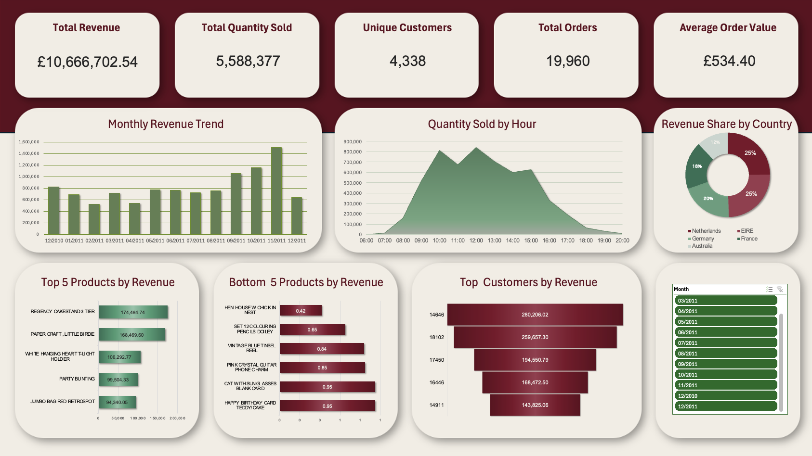

# Retail Sales Analysis – SQL & Excel

## Project Overview
Retail sales analysis project based on online store transaction data. The goal was to clean and analyze sales data, calculate business KPIs and build an Excel dashboard.

## Tools Used
- SQL
- Microsoft Excel
- Power Query
- Pivot Tables

## Key Analyses
- Total revenue
- Total orders
- Unique customers
- Monthly revenue trends
- Top products by revenue
- Top customers by revenue

## Files
- `Analiza_sprzedazy_sklepu_internetowego_Agata_Rybicka.pdf` – full project report
- `Retail_Sales_Dashboard.xlsb` – Excel dashboard file
- `Dashboard2.png` – dashboard preview

## Dashboard Preview

